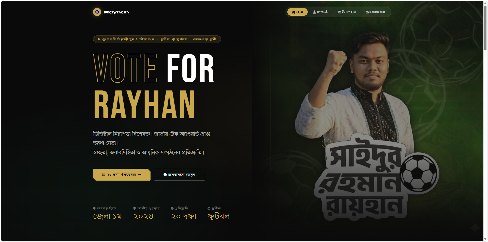

# Election Campaign Landing Page

Campaign manifesto landing page for Bangladesh election.

## Live Demo


## Preview



## Features

- Premium dark aesthetic with gold accents
- Fully responsive across all devices
- Bilingual support (Bengali/English typography)
- Scroll-triggered reveal animations
- Interactive 20-point manifesto timeline
- Custom cursor with hover effects
- Social media integration cards
- Scroll progress indicator

## Tech Stack

| Technology | Usage |
|------------|-------|
| HTML5 | Semantic structure |
| CSS3 | Animations, Grid, Flexbox |
| JavaScript | Interactive features |
| Font Awesome | Icons |
| Google Fonts | Typography |

## Project Structure

```
rayhan-2026/
├── index.html
├── css/
│   └── style.css
├── js/
│   └── main.js
├── assets/
│   └── image.jpeg
└── README.md
```

## Getting Started

```bash
git clone https://github.com/Aru-Ofc-git/vote-manifesto-bd
cd vote-manifesto-bd
open index.html
```

## Key Sections

- **Hero** - Campaign headline with stats
- **Marquee** - Scrolling campaign slogan
- **About** - Candidate biography and achievements
- **Manifesto** - 20-point election promises in timeline format
- **Contact** - Social media links and contact information

## Customization

Edit `index.html` to:
- Update candidate name and bio
- Modify contact information
- Change social media links

Modify `css/style.css` variables:
```css
:root {
  --ink: #0a0a0a;
  --paper: #f5f0e8;
  --gold: #c9a84c;
  --gold-light: #e8c97a;
  --red: #c0392b;
  --green: #1a5c3a;
  --slate: #2c3e50;
  --white: #fefefe;
}
```


## License

MIT - Feel free to use this template for your own projects.

---

### Connect With Me

- Linkedin: [@arman-ofc](https://www.linkedin.com/in/arman-ofc/)
- Facebook: [Ariful Islam Arman](https://www.facebook.com/1R13A14)
=======
